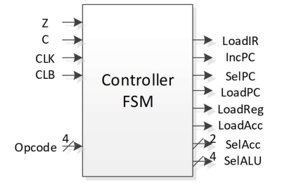
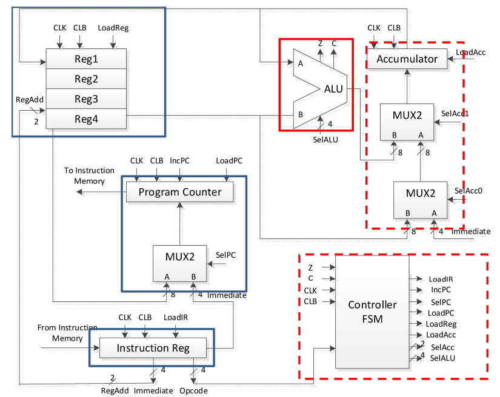

# Microcontroller
## Feature
An 8-bit microcontroller, 2-stage scalar processor supports several logic operations and branching
- Top-level design includes clk, clb, and 8-bit instruction input, PC addresses, Accumulator output
- Instruction contains Opcode in upper 4 bits, and Immediate number in lower 4 bits
- Testbench consist of three parts, Basic logic operations, Immediate jumping, and registers jumping
- Docfile describes details of processor in ports and function
- A report is attached in docfile directory

## Architecture
 
### Block Diagram of Controller
### Table of 8-bit microprocessor input/output
|Name|Description|I/O|Width|
|:----|:----|:----|:----|
|CLK|Clock  input|I|1  bit|
|CLB|Reset  input (low  active)|I|1  bit|
|INST[7:O]|Instruction  bus  coming  from  instruction  memory|I|8  bit|
|PC[7:O]|Address  bus  goes  into  instruction  memory|O|8  bit|
|ACCI7:O]|ACC  register  value (used  for  debugging  purpose)|O|8  bit|

 
### Block Diagram of the 8-bit Microprocessor Architecture

## Testbench

<details>
<summary>Input test vectors</summary>

```
D5// LD ACC #(05);
51// MOV R1 ACC;
D4// LD ACC #(04);
21// SUB ACC R1
5B// MOV R11 ACC, R11 = 8'hFF
11// ADD ACC R1;
B0// SHL ACC
31// NOR ACC R1;
C0// SHR ACC
41// MOV ACC R1
00// NOP ------------------------------
D3// LD ACC #(03)
1B// ADD ACC R11 --Loop1
7F// JZ #(), forward 2 adr
AC// JC #(), backward 2 adr
21// SUB ACC R1 --Loop2
AF// JC #(), backward 1 adr
00// NOP ------------------------------
D3// LD ACC #(03), R16=8'h21
52// MOV R2 ACC
D8// LD ACC #(), R16 upper bits 
B0// SHL
B0// SHL
5F// MOV R16 ACC
D1// LD ACC #(), R16 lower bits
1F// ADD ACC R16
5F// MOV R16 ACC, R16 stored
22// SUB ACC R2
5E// MOV R15 ACC
D3// LD ACC #(03)
1B// ADD ACC R11 --Loop11
6F// JZ R16, forward 2 adr
8E// JC R15, backward 2 adr
21// SUB ACC R1 --Loop22
8F// JC R16, backward 1 adr
00// NOP ------------------------------
F2// HALT
```

</details>

<details>
<summary>Output test vectors</summary>

```
05 // ACC = 01
05 // MOV R1 ACC, R1 = 8'h05
04 // ACC = 00
FF // ACC - R1
FF // MOV R11 ACC
04 // ACC + R1 = FF+05
08 // ACC << 1 
F2 // ACC NOR R1 
79 // ACC >> 1
05 // MOV ACC R1
05 // NOP ------------------------------
03 // LD ACC #(03)
02 // ADD ACC R1(FF) --loop1 start
02 // JZ0
02 // JC1
01 // ADD ACC R1(FF)
01 // JZ0
01 // JC1
00 // ADD ACC R1(FF)
00 // JZ1 --loop1 end
FB // ACC - R1 = 0-5 --loop2 start
FB // JC1
F6 // ACC - R1
F6 // JC0 -- loop2 end
F6 // NOP ------------------------------
03 // ACC = 03
03 // MOV R2 ACC, R2 = 8'h03
08 // ACC #(), R16 upper bits 
10 // ACC << 1 
20 // ACC << 1 
20 // MOV R16 ACC
01 // ACC #(), R16 lower bits
21 // ADD ACC R16
21 // MOV R16 ACC, R16 = 20
1E // ACC - R2
1E // MOV R15 ACC
03 // LD ACC #(03)
02 // ADD ACC R1(FF) --loop11 start
02 // JZ0
02 // JC1 R15
01 // ADD ACC R1(FF)
01 // JZ0
01 // JC1
00 // ADD ACC R1(FF)
00 // JZ1 R16 --loop11 end
FB // ACC - R1 = 0-5 --loop22 start
FB // JC1
F6 // ACC - R1
F6 // JC0 -- loop22 end
F6 // NOP ------------------------------
F6 // HALT
```
</details>

